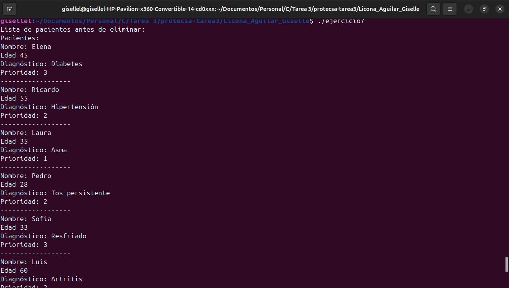

# protecsa-tarea3
Erick Nava y Giselle Licona

## Instrucciones para ejecutar el código

Para la ejecucion de los programas se utilizó la teminal del visual studio code. Se instaló
el packete de c/c++, posteriormente se instaló el C/C++ Compile Run. Con esta última extensión 
bastaa con presionar F6 para ejecutar el código en el visual studio code.

Los git ignore estan para evitar que se generen archivos 'basura'

Otra manera que se utilizó para compilar y ejecutar los programas en C, fue el compilador `gcc`. A continuación, se muestran los pasos:

1. Abre una terminal en la carpeta del repositorio.
2. Compila el código utilizando el siguiente comando:
   ```bash
   gcc nombrearchivo.c -o nombre
Donde:

- `nombrearchivo.c` es el archivo fuente C que quieres compilar.
- `nombre` es el nombre del archivo ejecutable que se generará.

3. Para ejecutar el programa, usa el siguiente comando:

```bash
./nombre


## Ejercicio 7



